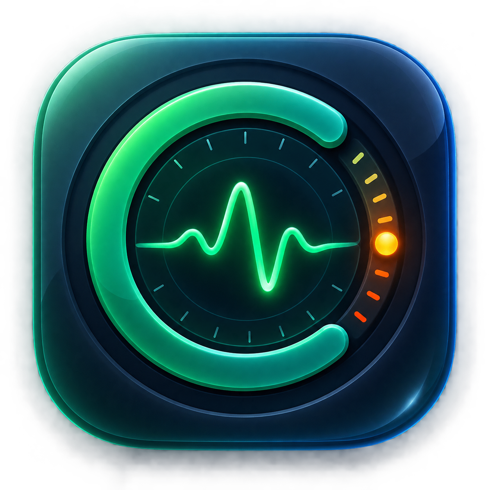

# Codex Pulse

Codex Pulse 是一个轻量的原生 macOS 菜单栏工具，用于显示 Codex 的 5 小时额度和周额度。界面完全使用 Swift + AppKit，不包含 Electron、WebView、Lottie、GIF、常驻动画或弹窗。



## 当前能力

- Touch Bar 显示 `CX 72%`，点击立即刷新。
- 菜单栏默认开启，打开菜单时立即刷新，可在设置中隐藏。
- Codex 运行时每 5 分钟刷新，未运行时每 20 分钟刷新。
- Mac 唤醒后立即刷新。
- 菜单显示 5H Capacity、Reset、Weekly、Refresh Now、Settings 和 Quit。
- 颜色阈值：31% 以上绿色，11%–30% 橙色，10% 以下红色。
- Launch at Login 使用 macOS 13+ 的 `SMAppService`。

## Touch Bar 常驻方式

Apple 的公开 `NSTouchBar` API 只允许当前前台 App 提供 Touch Bar 内容。Codex Pulse 将 `CX 72%` 注册为系统 Control Strip 项，因此切换 App 后仍然可见。

系统 Control Strip 接口未公开，因此应用不能上架 Mac App Store，未来的 macOS 版本也可能需要适配。Touch Bar 没有显示时，请确认“系统设置 → 键盘 → Touch Bar 设置 → Touch Bar 显示”选中“App 控制项”（可带 Control Strip）。

## 数据源

项目已将旧版 `CodexUsageMonitor.m` 的真实额度读取逻辑迁移到 `CodexQuotaProvider`：

1. 只读打开本机 `~/.codex/auth.json`。
2. 从登录信息中临时取得 access token 和 account ID。
3. 请求 Codex 官方 `https://chatgpt.com/backend-api/wham/usage` 接口。
4. 按窗口长度识别 5 小时额度和 7 天额度，并转换为 `QuotaSnapshot`。

凭据不会写入新文件，也不会发送到第三方服务。如果本机 `127.0.0.1:7897` 代理端口可用，请求会沿用旧版逻辑自动使用该代理。

`MockQuotaProvider` 仍保留，供无网络预览和测试使用。以后接口发生变化时，只需更新 Provider/Parser，UI 和刷新调度不需要修改。

## 项目结构

```text
CodexPulse/
├── Package.swift
├── AppSources/CodexPulse/
│   ├── CodexPulseMain.swift
│   ├── AppDelegate.swift
│   ├── Models/QuotaSnapshot.swift
│   ├── Services/
│   │   ├── QuotaProvider.swift
│   │   ├── CodexActivityDetector.swift
│   │   ├── RefreshCoordinator.swift
│   │   └── LaunchAtLoginController.swift
│   ├── Settings/SettingsStore.swift
│   └── UI/
│       ├── TouchBarController.swift
│       └── SettingsWindowController.swift
├── Tests/CodexPulseTests/
├── Scripts/package-app.sh
└── Support/Info.plist
```

## 构建和运行

需要 macOS 13 或更高版本，以及 Swift 编译器。构建脚本包含一个只影响当前编译进程的兼容层，可处理部分 Command Line Tools 同时存在两份 `SwiftBridging` 模块清单的问题，不会修改系统文件。

```bash
make test
make app
make run
```

生成可双击运行的 App：

```bash
make app
open ".build/Codex Pulse.app"
```

若启用 Launch at Login，建议先把生成的 `Codex Pulse.app` 移到 `/Applications` 后再开启该选项。隐藏菜单栏后，可再次双击 App 打开设置。
